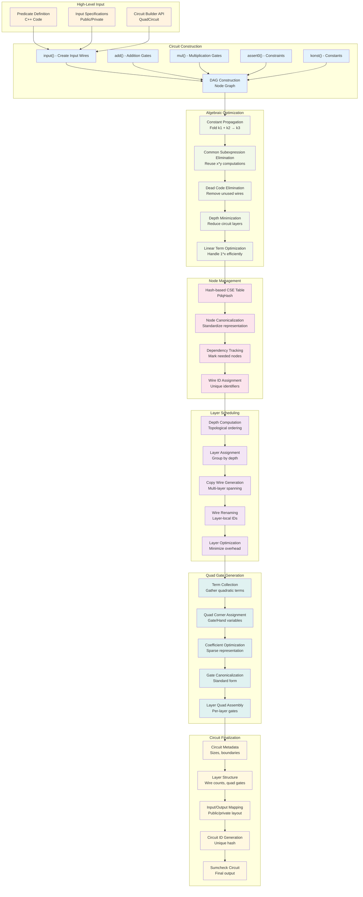

# Frontend (Arithmetization) in Longfellow ZK



## Detailed Arithmetization Process

### High-Level Input
- **Predicate Definition**: User writes C++ code defining the statement to prove
- **Input Specifications**: Designate which inputs are public vs. private
- **Circuit Builder API**: Use QuadCircuit class to construct arithmetic circuits

### Circuit Construction Phase
```cpp
QuadCircuit<Field> qc(field);
size_t x = qc.input();           // Create input wire
size_t y = qc.input();           // Another input wire
size_t z = qc.mul(x, y);         // Multiplication gate
size_t w = qc.add(z, x);         // Addition gate
qc.assert0(w);                   // Constraint: w = 0
```

### Algebraic Optimization
- **Constant Propagation**: Replace `konst(3) + konst(5)` with `konst(8)`
- **CSE**: Reuse computation of `x * y` if it appears multiple times
- **Dead Code Elimination**: Remove wires that don't affect outputs or constraints
- **Depth Minimization**: Reorganize to reduce circuit depth
- **Linear Optimization**: Handle `1 * x` terms efficiently

### Node Management
- **Hash-based CSE**: Use `PdqHash` for fast duplicate detection
- **Canonicalization**: Ensure `mul(x, y)` and `mul(y, x)` are identical
- **Dependency Tracking**: Mark which nodes are actually needed
- **Wire ID Assignment**: Assign unique identifiers to circuit wires

### Layer Scheduling
```cpp
class Scheduler {
  // Convert DAG to layered representation
  std::vector<std::vector<lnode>> order_by_layer();
  
  // Assign wire IDs within each layer
  void assign_wire_ids();
  
  // Generate final circuit structure
  std::unique_ptr<Circuit<Field>> mkcircuit();
};
```

### Quad Gate Generation
Transform arithmetic operations into quad gate representation:
```
Traditional: z = x * y
Quad Gate: ∑ᵢ vᵢ * wₗᵢ * wᵣᵢ where vᵢ=1, wₗᵢ=x, wᵣᵢ=y
```

### Circuit Finalization
Generate final `Circuit<Field>` structure:
```cpp
struct Circuit<Field> {
  size_t nl;                    // Number of layers
  size_t ninputs, npub_in;      // Input counts
  std::vector<Layer<Field>> l;  // Circuit layers
  uint8_t id[32];              // Unique circuit ID
};
```

## Key Data Structures

### Node Representation
```cpp
template <class Field>
struct NodeF {
  std::vector<term> terms;      // Quadratic terms
  NodeInfoF<Field> info;        // Metadata (depth, wire IDs)
};

struct term {
  size_t ki;                    // Constant index
  size_t op0, op1;             // Operand wire IDs
};
```

### Quad Gate Structure
```cpp
template <class Field>
class Quad {
  struct corner {
    quad_corner_t g;            // Gate variable
    quad_corner_t h[2];         // Hand variables (left, right)
    Elt v;                      // Coefficient
  };
  std::vector<corner> c_;       // Quad terms
};
```

### Layer Structure
```cpp
template <class Field>
struct Layer {
  corner_t nw;                  // Number of wires
  size_t logw;                  // Log of wire count
  std::unique_ptr<const Quad<Field>> quad;  // Quadratic gates
};
```

## Optimization Techniques

### Common Subexpression Elimination
- Use cryptographic hash of node structure
- Maintain hash table mapping hash → node ID
- Reuse existing nodes for identical computations

### Constant Propagation
- Fold arithmetic operations on constants at compile time
- Propagate constants through linear operations
- Eliminate multiplications by zero or one

### Dead Code Elimination
- Mark nodes needed for outputs or assertions
- Propagate "needed" marks backward through dependencies
- Remove unmarked nodes from final circuit

### Layer Optimization
- Minimize circuit depth to reduce sumcheck rounds
- Balance layer sizes for efficient processing
- Minimize copy wires between layers

## Example: Simple Circuit Compilation

```cpp
// Input: Prove x² + y² = z
QuadCircuit<Field> qc(field);

// Public input
size_t z = qc.input();
qc.private_input();

// Private inputs
size_t x = qc.input();
size_t y = qc.input();

// Computation
size_t x2 = qc.mul(x, x);      // x²
size_t y2 = qc.mul(y, y);      // y²
size_t sum = qc.add(x2, y2);   // x² + y²
size_t diff = qc.sub(sum, z);  // x² + y² - z
qc.assert0(diff);              // Assert x² + y² - z = 0

// Compile
auto circuit = qc.mkcircuit(1);
```

This produces a layered circuit where:
- Layer 0: Input wires (z, x, y)
- Layer 1: Quadratic operations (x², y²)
- Layer 2: Linear operations (x² + y², x² + y² - z)
- Layer 3: Assertion (x² + y² - z = 0) 