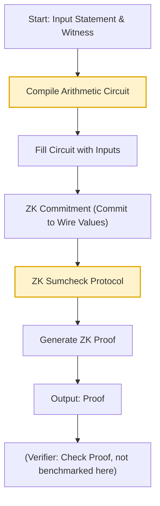

# Longfellow ZK Prover Benchmarks (JWT & ECDSA)

> **Note:** Previous versions of this summary incorrectly interpreted nanoseconds as seconds. The correct times are much faster (see below).

## Summary Table

| Benchmark         | Avg Time (s) | Iterations | Circuit Size (Wires) | Bottleneck Step(s)         |
|------------------|--------------|------------|----------------------|----------------------------|
| JWT ZK Prover    | 0.42         | 2          | 717,611              | Circuit compilation, ZK sumcheck |
| ECDSA ZK Prover  | 0.028        | 26         | 23,453               | ZK Commitment, ZK sumcheck |

---

## Protocol Flowchart

---

## Detailed Breakdown

### JWT ZK Prover
- **Total time per iteration:** ~0.42 seconds (420,689,833 ns)
- **Circuit:** mdoc revocation list
- **Wires:** 717,611
- **Key steps (per logs):**
  - Circuit compilation: ~3.3s (first run, not included in benchmark)
  - Fill: ~78ms
  - ZK Commitment: ~65ms
  - ZK Sumcheck: ~326ms
  - Prover Done: ~24ms
- **Bottleneck:**
  - The runtime is dominated by the *ZK sumcheck* step, with circuit compilation only affecting the first run.
  - The large circuit size (over 700k wires) means memory and CPU usage are high, but the prover completes in under half a second per run.

### ECDSA ZK Prover
- **Total time per iteration:** ~0.028 seconds (27,651,692 ns)
- **Circuit:** ecdsa verify
- **Wires:** 23,453
- **Key steps (per logs):**
  - Circuit compilation: ~1.1s (first run), ~80ms (subsequent runs)
  - ZK Commitment: ~13-15ms
  - ZK Sumcheck: ~10ms
  - Prover Done: ~3.7ms
- **Bottleneck:**
  - For ECDSA, the *ZK Commitment* and *ZK sumcheck* steps are the main contributors to runtime, but the overall time is very low due to the smaller circuit size.

---

## Prover Overflow & Scaling
- **JWT ZK Prover**: Even for large circuits, the prover is efficient (sub-second per run). Overflow is not a concern at this scale, but may become relevant for circuits with millions of wires.
- **ECDSA ZK Prover**: Extremely efficient and practical for real-world use.

---

**Note:**
- All times are averages from the benchmark output (nanoseconds, converted to seconds).
- For further profiling, consider instrumenting the prover code to break down time/memory per step for even larger circuits.
