# High-Level E2E Workflow of Longfellow ZK

```mermaid
flowchart TD
    subgraph "User Application"
        A1[Define Predicate/<br/>Statement]
        A2[Prepare Public/<br/>Private Inputs]
    end
    
    subgraph "Frontend: Arithmetization"
        B1[QuadCircuit<br/>Construction]
        B2[Basic Operations<br/>add, mul, input, assert0]
        B3[Constant<br/>Propagation]
        B4[Common Subexpression<br/>Elimination]
        B5[Dead Code<br/>Elimination]
        B6[Layer<br/>Scheduling]
        B7[Quad Gate<br/>Generation]
        B8[Circuit<br/>Compilation]
    end
    
    subgraph "Backend: Proof System"
        C1[Witness<br/>Assignment]
        C2[Circuit<br/>Evaluation]
        C3[ZK Commitment<br/>Phase]
        C4[Random Padding<br/>Generation]
        C5[Merkle/Ligero<br/>Commitment]
        C6[Sumcheck<br/>Protocol]
        C7[Layer-by-Layer<br/>Proving]
        C8[Ligero SNARK<br/>Generation]
        C9[Proof<br/>Serialization]
    end
    
    subgraph "Verification"
        D1[Proof<br/>Deserialization]
        D2[Public Input<br/>Validation]
        D3[Sumcheck<br/>Verification]
        D4[Ligero<br/>Verification]
        D5[Accept/<br/>Reject]
    end
    
    A1 --> B1
    A2 --> C1
    
    B1 --> B2
    B2 --> B3
    B3 --> B4
    B4 --> B5
    B5 --> B6
    B6 --> B7
    B7 --> B8
    
    B8 --> C1
    C1 --> C2
    C2 --> C3
    C3 --> C4
    C4 --> C5
    C5 --> C6
    C6 --> C7
    C7 --> C8
    C8 --> C9
    
    C9 --> D1
    D1 --> D2
    D2 --> D3
    D3 --> D4
    D4 --> D5
    
    classDef frontend fill:#e1f5fe
    classDef backend fill:#f3e5f5
    classDef verification fill:#e8f5e8
    classDef application fill:#fff3e0
    
    class B1,B2,B3,B4,B5,B6,B7,B8 frontend
    class C1,C2,C3,C4,C5,C6,C7,C8,C9 backend
    class D1,D2,D3,D4,D5 verification
    class A1,A2 application
```

## Workflow Description

### 1. User Application Layer
- **Define Predicate**: User specifies the statement to prove (e.g., "I know x such that SHA256(x) = y")
- **Prepare Inputs**: Separate public inputs (known to verifier) from private inputs (witness)

### 2. Frontend: Arithmetization
- **QuadCircuit Construction**: Build arithmetic circuit using high-level operations
- **Optimization Passes**: Apply compiler optimizations to reduce circuit size and depth
- **Circuit Compilation**: Convert optimized DAG into layered sumcheck circuit with quad gates

### 3. Backend: Proof System
- **Witness Assignment**: Assign concrete values to all circuit wires
- **ZK Commitment**: Commit to witness with random padding for zero-knowledge
- **Sumcheck Protocol**: Generate interactive proof of circuit satisfiability
- **Ligero SNARK**: Prove knowledge of committed witness satisfying constraints

### 4. Verification
- **Proof Validation**: Verify sumcheck transcript and Ligero proof components
- **Decision**: Accept proof if all checks pass, reject otherwise

## Key Components
- **QuadCircuit**: High-level circuit builder with optimization
- **Sumcheck**: Interactive protocol for arithmetic circuit satisfiability  
- **Ligero**: SNARK for committed witness knowledge
- **Merkle Trees**: Cryptographic commitments for zero-knowledge 