# E2E Flow Described in libzk (IETF Draft)

```mermaid
flowchart TD
    subgraph "Input Phase"
        A1[Public Statement]
        A2[Private Witness]
        A3[Circuit Definition]
    end
    
    subgraph "Compilation Phase"
        B1[Parse Circuit Description]
        B2[Arithmetization]
        B3[Gate Optimization]
        B4[Layer Organization]
        B5[Circuit Finalization]
    end
    
    subgraph "Commitment Phase"
        C1[Witness Preparation]
        C2[Random Padding Generation]
        C3[Polynomial Commitment]
        C4[Merkle Tree Construction]
        C5[Root Hash Generation]
    end
    
    subgraph "Proving Phase"
        D1[Sumcheck Initialization]
        D2[Layer-by-Layer Reduction]
        D3[Polynomial Evaluation]
        D4[Challenge Generation<br/>Fiat-Shamir]
        D5[Response Computation]
        D6[Transcript Generation]
    end
    
    subgraph "NIZK Phase"
        E1[Ligero Setup]
        E2[Linear Constraint Assembly]
        E3[Quadratic Constraint Assembly]
        E4[Low-Degree Test]
        E5[Dot Product Test]
        E6[Quadratic Test]
        E7[Column Opening]
    end
    
    subgraph "Output Phase"
        F1[Proof Aggregation]
        F2[Proof Serialization]
        F3[Verification Data]
    end
    
    subgraph "Verification Phase"
        G1[Proof Deserialization]
        G2[Public Input Check]
        G3[Sumcheck Verification]
        G4[Ligero Verification]
        G5[Merkle Path Verification]
        G6[Accept/Reject Decision]
    end
    
    A1 --> B1
    A2 --> C1
    A3 --> B1
    
    B1 --> B2
    B2 --> B3
    B3 --> B4
    B4 --> B5
    
    B5 --> C1
    C1 --> C2
    C2 --> C3
    C3 --> C4
    C4 --> C5
    
    C5 --> D1
    D1 --> D2
    D2 --> D3
    D3 --> D4
    D4 --> D5
    D5 --> D6
    
    D6 --> E1
    E1 --> E2
    E2 --> E3
    E3 --> E4
    E4 --> E5
    E5 --> E6
    E6 --> E7
    
    E7 --> F1
    F1 --> F2
    F2 --> F3
    
    F3 --> G1
    G1 --> G2
    G2 --> G3
    G3 --> G4
    G4 --> G5
    G5 --> G6
    
    classDef input fill:#fff3e0
    classDef compilation fill:#e3f2fd
    classDef commitment fill:#f1f8e9
    classDef proving fill:#fce4ec
    classDef nizk fill:#f3e5f5
    classDef output fill:#e0f2f1
    classDef verification fill:#fff8e1
    
    class A1,A2,A3 input
    class B1,B2,B3,B4,B5 compilation
    class C1,C2,C3,C4,C5 commitment
    class D1,D2,D3,D4,D5,D6 proving
    class E1,E2,E3,E4,E5,E6,E7 nizk
    class F1,F2,F3 output
    class G1,G2,G3,G4,G5,G6 verification
```

## libzk Protocol Flow Description

### Input Phase
- **Public Statement**: The claim to be proven (e.g., "I know a preimage of this hash")
- **Private Witness**: Secret information that satisfies the statement
- **Circuit Definition**: Arithmetic circuit encoding the statement verification

### Compilation Phase
- **Parsing**: Convert high-level circuit description to internal representation
- **Arithmetization**: Transform into arithmetic operations over finite fields
- **Optimization**: Apply circuit optimizations (CSE, constant folding, etc.)
- **Layer Organization**: Structure circuit for efficient sumcheck protocol
- **Finalization**: Generate final circuit with unique identifier

### Commitment Phase
- **Witness Preparation**: Organize witness values for commitment
- **Random Padding**: Generate random values for zero-knowledge hiding
- **Polynomial Commitment**: Commit to witness using polynomial commitment scheme
- **Merkle Tree**: Build Merkle tree over committed polynomials
- **Root Generation**: Compute Merkle root as commitment

### Proving Phase (Sumcheck)
- **Initialization**: Set up sumcheck protocol with circuit and witness
- **Layer Reduction**: Process each circuit layer with sumcheck rounds
- **Polynomial Evaluation**: Compute univariate polynomials for each round
- **Challenge Generation**: Use Fiat-Shamir to generate verifier challenges
- **Response Computation**: Evaluate polynomials at challenge points
- **Transcript**: Generate complete sumcheck transcript

### NIZK Phase (Ligero)
- **Setup**: Initialize Ligero parameters and tableau structure
- **Linear Constraints**: Assemble linear constraints from sumcheck verification
- **Quadratic Constraints**: Handle quadratic constraints for witness products
- **Low-Degree Test**: Prove committed polynomials have correct degree
- **Dot Product Test**: Verify linear combinations of committed values
- **Quadratic Test**: Verify quadratic relationships in witness
- **Column Opening**: Open random columns for soundness verification

### Output Phase
- **Aggregation**: Combine sumcheck proof with Ligero proof
- **Serialization**: Convert proof to transmittable format
- **Verification Data**: Package proof with public verification information

### Verification Phase
- **Deserialization**: Parse received proof data
- **Public Input Check**: Validate public inputs and statement
- **Sumcheck Verification**: Verify sumcheck transcript consistency
- **Ligero Verification**: Verify Ligero SNARK components
- **Merkle Verification**: Check Merkle tree openings and paths
- **Decision**: Accept if all checks pass, reject otherwise

## Key Protocol Properties

### Security Properties
- **Completeness**: Honest prover with valid witness always convinces verifier
- **Soundness**: Malicious prover without valid witness cannot convince verifier
- **Zero-Knowledge**: Proof reveals nothing about witness beyond statement validity

### Efficiency Properties
- **Prover Time**: Quasi-linear in circuit size
- **Verifier Time**: Sublinear in circuit size (for Ligero component)
- **Proof Size**: Square-root scaling with circuit size
- **Communication**: Non-interactive after Fiat-Shamir transformation 